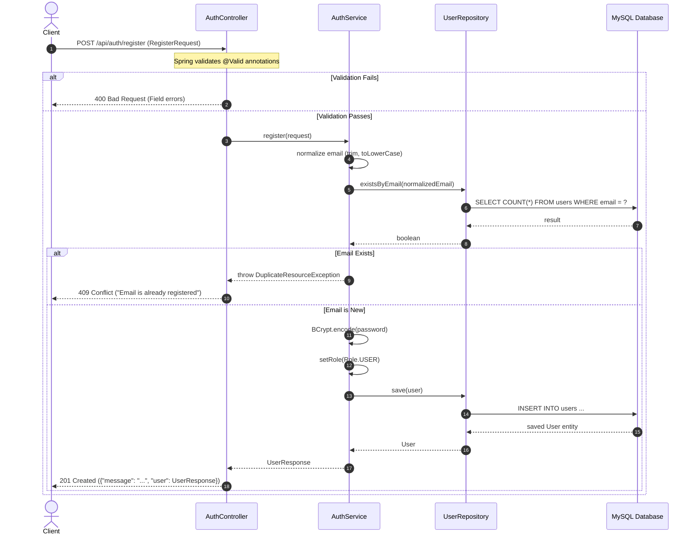
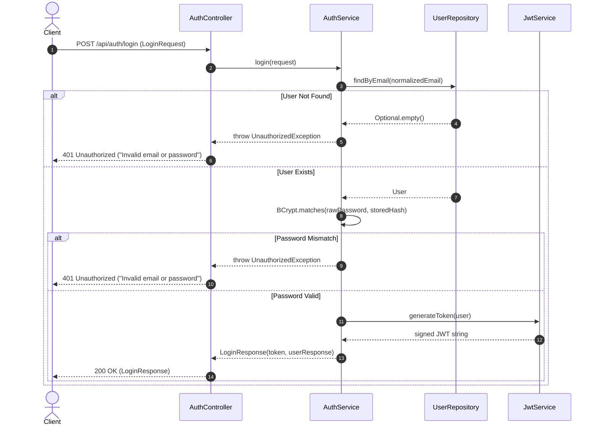
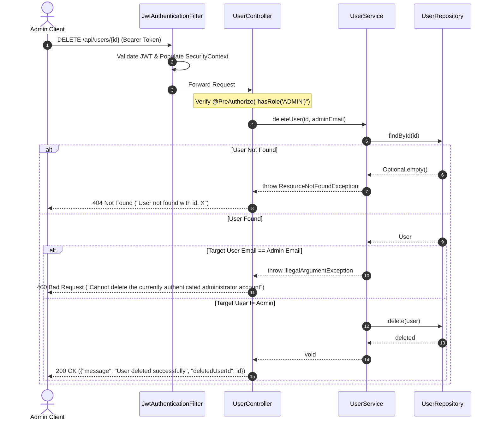

# Enterprise REST API Documentation
**User Management System (UMS)**

---

## 1. Document Control

| Property | Details |
|---|---|
| **Document Title** | Enterprise REST API Specification & Contract Reference |
| **System Name** | User Management System (UMS) |
| **Target Audience** | Backend Developers, Frontend Developers, QA/API Testers, Automation Engineers, DevOps Engineers, Solution Architects, Technical Leads, Technical Onboarding Engineers |
| **Document Version** | 1.0.0 |
| **Implementation Version** | `1.0.0` (from [backend/pom.xml](file:///c:/Users/SUJAN/Documents/Placements/Testing%20-%20Juspay/UMS/backend/pom.xml#L16)) |
| **Classification** | Internal Technical Documentation / Production API Contract |
| **Codebase Source of Truth** | Java 17 / Spring Boot 3.2.4 Application ([backend](file:///c:/Users/SUJAN/Documents/Placements/Testing%20-%20Juspay/UMS/backend)) |
| **Last Reviewed Date** | 2026-10-05 |
| **Author** | Senior API Architect, Technical Writer & QA/API Testing Specialist |

---

## 2. API Overview

The **User Management System (UMS) REST API** is an enterprise backend service providing authentication, role-based user management, and user lifecycle administration. The service is implemented using modern Spring Boot 3 standards, enforcing stateless JSON Web Token (JWT) authentication, strict role-based access control (RBAC), database constraints via Spring Data JPA/Hibernate 6, and centralized exception handling.

### Key Architectural Characteristics
- **Protocol**: HTTP/1.1 over TCP / TLS
- **Data Exchange Format**: `application/json;charset=UTF-8`
- **Architectural Style**: RESTful resource-oriented JSON API
- **State Management**: Fully Stateless (`SessionCreationPolicy.STATELESS`)
- **Security Standard**: JSON Web Token (RFC 7519) utilizing HMAC-SHA256 signature algorithms via JJWT 0.12.5
- **Persistence Store**: Relational Database Management System (MySQL 8)

---

## 3. API Architecture

The backend follows a strictly layered, decoupled enterprise architecture:

```text
       HTTP Clients (Browser / Automation Suites / cURL / Postman)
                                   │
                                   ▼
             [CorsConfig] ──► CORS Pre-flight & Filter
                                   │
                                   ▼
                     [JwtAuthenticationFilter]
           (Extracts Bearer token, validates signature/claims)
                                   │
                                   ▼
                       [SecurityFilterChain]
              (Enforces URL patterns & RBAC authorities)
                                   │
         ┌─────────────────────────┴─────────────────────────┐
         ▼                                                   ▼
[AuthController]                                     [UserController]
 (/api/auth)                                          (/api/users)
   ├── POST /register                                   ├── GET /
   └── POST /login                                      ├── POST /
         │                                              └── DELETE /{id}
         ▼                                                   │
  [AuthService]                                              ▼
         │                                             [UserService]
         └─────────────────────────┬─────────────────────────┘
                                   │
                                   ▼
                         [UserRepository] (Spring Data JPA)
                                   │
                                   ▼
                           MySQL Database (`users` table)
                                   ▲
                                   │
                    [GlobalExceptionHandler]
         (Intercepts all uncaught exceptions across all layers)
```

### Component Responsibilities:
1. **Security Filter Pipeline**: Intercepts requests, validates Authorization headers, injects authenticated user principals into Spring's `SecurityContextHolder`, and returns standardized JSON errors for 401 Unauthorized or 403 Forbidden events.
2. **Controller Layer**: Handles HTTP requests, deserializes JSON payloads, triggers Bean Validation (`@Valid`), delegates to the domain service layer, and shapes the HTTP status and `ResponseEntity`.
3. **Service Layer**: Contains transactional domain logic, normalization (email lowercasing and trimming), BCrypt password hashing, duplication checks, and administrative self-deletion guards.
4. **Repository Layer**: Interfaces with MySQL via Spring Data JPA using parameterized Hibernate queries.
5. **Exception Handling Layer**: Centralized `@RestControllerAdvice` converting all validation, business, security, and runtime exceptions into a uniform `ErrorResponse` model.

---

## 4. Base URLs & Environments

### Base URL Patterns
- **Context Path**: `/` (Default Spring Boot root context)
- **API Prefix**: `/api`
- **Default Server Port**: `8080` (Configurable via `PORT` environment variable)

| Environment | Base URL | Host / Port Details | Data Store |
|---|---|---|---|
| **Local Development** | `http://localhost:8080` | `server.port=${PORT:8080}` | MySQL (`localhost:3306/ums_db`) |
| **Container / Docker** | `http://<container-host>:8080` | Configured via environment variables | Containerized MySQL service |
| **Frontend Dev Proxy** | `http://localhost:5173/api` | Vite reverse-proxies `/api` to port `8080` | Shared MySQL backend |

### CORS Configuration
Configured in [CorsConfig.java](file:///c:/Users/SUJAN/Documents/Placements/Testing%20-%20Juspay/UMS/backend/src/main/java/com/example/ums/config/CorsConfig.java):
- **Allowed Origins**: Configured via property `ums.cors.allowed-origins` (Default: `http://localhost:5173`, `http://localhost:3000`).
- **Allowed HTTP Methods**: `GET`, `POST`, `PUT`, `DELETE`, `OPTIONS`.
- **Allowed Headers**: `Authorization`, `Content-Type`, `Accept`, `Origin`, `X-Requested-With`.
- **Allow Credentials**: `true`.
- **Pre-flight Cache Max Age**: `3600` seconds (1 hour).

---

## 5. Authentication

Authentication is handled via **JSON Web Tokens (JWT)**. Sessions are completely stateless; no HTTP sessions, session cookies, or server-side session stores exist.

### 5.1 Login & Token Generation
1. The client submits credentials to `POST /api/auth/login`.
2. [AuthService.java](file:///c:/Users/SUJAN/Documents/Placements/Testing%20-%20Juspay/UMS/backend/src/main/java/com/example/ums/service/AuthService.java) normalizes the email (`trim().toLowerCase()`) and queries `UserRepository`.
3. If the user does not exist or `passwordEncoder.matches()` returns `false`, an `UnauthorizedException("Invalid email or password")` is thrown.
4. If valid, [JwtService.java](file:///c:/Users/SUJAN/Documents/Placements/Testing%20-%20Juspay/UMS/backend/src/main/java/com/example/ums/security/JwtService.java) generates a signed compact JWT.
5. The token and user profile are returned in `LoginResponse`.

### 5.2 JWT Token Specifications
- **Signing Algorithm**: HMAC using SHA-256 (`HS256` / `Keys.hmacShaKeyFor`)
- **Configured Secret**: `ums.jwt.secret` (Default: 256-bit hexadecimal string `404E635266556A586E3272357538782F413F4428472B4B6250645367566B5970`)
- **Configured Expiration**: `ums.jwt.expiration-ms` (Default: `86400000` ms = **24 hours**)
- **Payload Standard Claims**:
  - `sub`: User's normalized email address (`user.getEmail()`)
  - `iat`: Timestamp of token issuance (milliseconds since epoch)
  - `exp`: Timestamp of token expiration (`iat + 86400000`)
- **Payload Custom Claims**:
  - `id`: Database Primary Key (`user.getId()`, Long)
  - `name`: Full Name (`user.getName()`, String)
  - `role`: Role string representation (`user.getRole().name()`, e.g., `"ADMIN"` or `"USER"`)

### 5.3 Token Transmission Header
For all protected endpoints, the client must supply the HTTP request header:
```http
Authorization: Bearer <JWT_TOKEN_STRING>
```

### 5.4 Token Validation Lifecycle
[JwtAuthenticationFilter.java](file:///c:/Users/SUJAN/Documents/Placements/Testing%20-%20Juspay/UMS/backend/src/main/java/com/example/ums/security/JwtAuthenticationFilter.java) executes once per incoming request:
1. Checks for the `Authorization` header starting with `"Bearer "`. If absent, control passes immediately to the Spring Security filter chain.
2. Extracts and parses the token using `JwtService.extractUsername(jwt)`.
3. If valid and no authentication exists in `SecurityContextHolder`, it loads the user via `CustomUserDetailsService.loadUserByUsername(email)`.
4. Checks `isTokenValid(jwt, userDetails)`:
   - Username in token matches `UserDetails.getUsername()`.
   - Expiration date is strictly after `new Date()`.
5. If valid, builds a `UsernamePasswordAuthenticationToken` with granted authority `ROLE_<ROLE_NAME>` (e.g. `ROLE_ADMIN` or `ROLE_USER`) and registers it in `SecurityContextHolder`.
6. If the token is invalid, expired, malformed, or tampered with, the exception is caught silently inside `JwtAuthenticationFilter`, leaving the security context unauthenticated. Subsequent access to protected endpoints triggers the custom 401 `authenticationEntryPoint`.

---

## 6. Authorization & Role-Based Access Control (RBAC)

The system defines two discrete roles declared in the enum [Role.java](file:///c:/Users/SUJAN/Documents/Placements/Testing%20-%20Juspay/UMS/backend/src/main/java/com/example/ums/entity/Role.java):
1. **`ROLE_ADMIN`**: Elevated system administrator with permissions to inspect the directory, provision standard users, and delete user records.
2. **`ROLE_USER`**: Standard end-user with permissions to register, log in, and view the user directory in read-only mode.

### Authorization Matrix

| Endpoint | HTTP Method | Public | ROLE_USER | ROLE_ADMIN | Enforced By |
|---|---|:---:|:---:|:---:|---|
| `/api/auth/register` | `POST` | **✓** | **✓** | **✓** | `SecurityConfig` (`permitAll()`) |
| `/api/auth/login` | `POST` | **✓** | **✓** | **✓** | `SecurityConfig` (`permitAll()`) |
| `/api/users` | `GET` | **✗** | **✓** | **✓** | `SecurityConfig` (`hasAnyRole('ADMIN', 'USER')`) & `@PreAuthorize("hasAnyRole('ADMIN', 'USER')")` |
| `/api/users` | `POST` | **✗** | **✗** | **✓** | `SecurityConfig` (`hasRole('ADMIN')`) & `@PreAuthorize("hasRole('ADMIN')")` |
| `/api/users/{id}` | `DELETE` | **✗** | **✗** | **✓** (Except Self) | `SecurityConfig` (`hasRole('ADMIN')`) & `@PreAuthorize("hasRole('ADMIN')")` & `UserService` |

### Security Interceptor Response Behavior
- **Unauthenticated Access (Missing/Invalid Token)**: Returns HTTP `401 Unauthorized` with JSON body:
  ```json
  {
    "timestamp": "2026-10-05T11:41:53",
    "status": 401,
    "error": "Unauthorized",
    "message": "Full authentication is required to access this resource"
  }
  ```
- **Unauthorized Role Access (Authenticated as `USER` accessing Admin APIs)**: Returns HTTP `403 Forbidden` with JSON body:
  ```json
  {
    "timestamp": "2026-10-05T11:41:53",
    "status": 403,
    "error": "Forbidden",
    "message": "Access denied: You do not have sufficient role permissions"
  }
  ```

---

## 7. API Inventory

| # | HTTP Method | Path | Summary / Purpose | Authentication | Authorization |
|---|---|---|---|---|---|
| 1 | `POST` | `/api/auth/register` | Self-register a new standard user account | None (Public) | Public |
| 2 | `POST` | `/api/auth/login` | Authenticate credentials and acquire signed JWT | None (Public) | Public |
| 3 | `GET` | `/api/users` | Retrieve complete directory of registered users | Bearer JWT | `ROLE_ADMIN`, `ROLE_USER` |
| 4 | `POST` | `/api/users` | Administratively create a new standard user | Bearer JWT | `ROLE_ADMIN` only |
| 5 | `DELETE` | `/api/users/{id}` | Permanently delete a user account by database ID | Bearer JWT | `ROLE_ADMIN` only (Self-deletion blocked) |

---

## 8. Endpoint Documentation

### 8.1 API: Register User Account

#### Endpoint
```http
POST /api/auth/register
```

#### Purpose
Allows public unauthenticated clients to register a new user account. Registration unconditionally assigns `Role.USER`. A client cannot grant itself administrative privileges.

#### Authentication
**Not Required** (Public endpoint configured via `permitAll()`)

#### Authorization
**Public** (Accessible to any anonymous client)

#### Request Headers
| Header | Required | Value | Description |
|---|:---:|---|---|
| `Content-Type` | Yes | `application/json` | Specifies request body serialization format |

#### Path Parameters
`None`

#### Query Parameters
`None`

#### Request Body
```json
{
  "name": "Jane Doe",
  "email": "jane.doe@example.com",
  "password": "Password@123"
}
```

##### Request Body Field Specification
| Field | Type | Required | Validation Constraints | Description |
|---|---|:---:|---|---|
| `name` | String | **Yes** | `@NotBlank(message = "Name is required")`<br>`@Pattern(regexp = "^[A-Za-z\\s]+$", message = "Name must contain only alphabetic characters and spaces")`<br>`@Size(max = 50, message = "Name must not exceed 50 characters")` | User's full display name. Must consist only of letters and spaces. |
| `email` | String | **Yes** | `@NotBlank(message = "Email is required")`<br>`@Email(message = "Email must be valid")` | User's email address. Normalized to lowercase and trimmed before uniqueness check. |
| `password` | String | **Yes** | `@NotBlank(message = "Password is required")`<br>`@Size(min = 8, message = "Password must be at least 8 characters")` | Plaintext user password. Minimum length of 8 characters. Hashed using BCrypt. |

#### Successful Response
- **HTTP Status**: `201 Created`
- **Content-Type**: `application/json`

```json
{
  "message": "User registered successfully",
  "user": {
    "id": 2,
    "name": "Jane Doe",
    "email": "jane.doe@example.com",
    "role": "USER",
    "createdAt": "2026-10-05T10:30:00",
    "updatedAt": "2026-10-05T10:30:00"
  }
}
```

##### Response Field Specification
| Field | Type | Nullable | Description |
|---|---|:---:|---|
| `message` | String | No | Static confirmation string: `"User registered successfully"` |
| `user` | Object | No | Sanitized user profile object ([UserResponse](file:///c:/Users/SUJAN/Documents/Placements/Testing%20-%20Juspay/UMS/backend/src/main/java/com/example/ums/dto/UserResponse.java)) |
| `user.id` | Long | No | Auto-incremented primary key generated by MySQL |
| `user.name` | String | No | Sanitized, trimmed full name of the registered user |
| `user.email` | String | No | Normalized (lowercase, trimmed) registered email |
| `user.role` | String (Enum) | No | Always `"USER"` for self-registration |
| `user.createdAt` | String (ISO-8601) | No | Timestamp of record creation in database |
| `user.updatedAt` | String (ISO-8601) | No | Timestamp of last record update |

#### HTTP Status Codes
| Status | Meaning | Condition | Response Payload |
|:---:|---|---|---|
| **201** | Created | User was successfully validated, hashed, and persisted into MySQL. | Full response object with user details |
| **400** | Bad Request | Validation failure on name, email, or password (e.g. invalid email format, name with numbers, password < 8 characters). | Standard `ErrorResponse` with validation messages |
| **409** | Conflict | The supplied email already exists in `UserRepository` (`DuplicateResourceException`). | `{"status": 409, "error": "Conflict", "message": "Email is already registered: <email>"}` |
| **500** | Internal Server Error | Uncaught database or internal error. | `{"status": 500, "error": "Internal Server Error", "message": "An unexpected internal server error occurred"}` |

#### Business Logic
1. Request payload is validated against Bean Validation annotations.
2. `request.getEmail().trim().toLowerCase()` produces a normalized email key.
3. `userRepository.existsByEmail(normalizedEmail)` checks for existing accounts.
4. If found, a `DuplicateResourceException` is thrown, yielding HTTP 409.
5. Plaintext password is encrypted via `BCryptPasswordEncoder` (work factor 10).
6. User role is forced to `Role.USER`.
7. User entity is saved to MySQL, triggering `@PrePersist` to populate `createdAt` and `updatedAt`.
8. The saved entity is converted into `UserResponse` (excluding the password hash) and wrapped with a success message in a Map.

---

### 8.2 API: Authenticate User & Acquire Token

#### Endpoint
```http
POST /api/auth/login
```

#### Purpose
Authenticates user credentials against the MySQL database. Upon valid verification, generates and returns a signed JWT containing user claims.

#### Authentication
**Not Required** (Public endpoint configured via `permitAll()`)

#### Authorization
**Public** (Accessible to any anonymous client)

#### Request Headers
| Header | Required | Value | Description |
|---|:---:|---|---|
| `Content-Type` | Yes | `application/json` | Specifies request body serialization format |

#### Path Parameters
`None`

#### Query Parameters
`None`

#### Request Body
```json
{
  "email": "admin@test.com",
  "password": "Admin@123"
}
```

##### Request Body Field Specification
| Field | Type | Required | Validation Constraints | Description |
|---|---|:---:|---|---|
| `email` | String | **Yes** | `@NotBlank(message = "Email is required")`<br>`@Email(message = "Email must be valid")` | Registered account email address. Case-insensitive. |
| `password` | String | **Yes** | `@NotBlank(message = "Password is required")` | Plaintext account password. |

#### Successful Response
- **HTTP Status**: `200 OK`
- **Content-Type**: `application/json`

```json
{
  "token": "eyJhbGciOiJIUzI1NiJ9.eyJpZCI6MSwibmFtZSI6IlN5c3RlbSBBZG1pbmlzdHJhdG9yIiwicm9sZSI6IkFETUlOIiwic3ViIjoiYWRtaW5AdGVzdC5jb20iLCJpYXQiOjE3Mjk4NTYwMDAsImV4cCI6MTcyOTk0MjQwMH0.signature",
  "user": {
    "id": 1,
    "name": "System Administrator",
    "email": "admin@test.com",
    "role": "ADMIN",
    "createdAt": "2026-10-05T08:00:00",
    "updatedAt": "2026-10-05T08:00:00"
  }
}
```

##### Response Field Specification
| Field | Type | Nullable | Description |
|---|---|:---:|---|
| `token` | String | No | Signed compact JWT Bearer token valid for 24 hours |
| `user` | Object | No | Authenticated user profile ([UserResponse](file:///c:/Users/SUJAN/Documents/Placements/Testing%20-%20Juspay/UMS/backend/src/main/java/com/example/ums/dto/UserResponse.java)) |
| `user.id` | Long | No | Database ID of the authenticated user |
| `user.name` | String | No | Full name of the user |
| `user.email` | String | No | Email address |
| `user.role` | String (Enum) | No | Assigned role (`"ADMIN"` or `"USER"`) |
| `user.createdAt` | String (ISO-8601) | No | Timestamp of account registration |
| `user.updatedAt` | String (ISO-8601) | No | Timestamp of last account update |

#### HTTP Status Codes
| Status | Meaning | Condition | Response Payload |
|:---:|---|---|---|
| **200** | OK | Credentials match active record in MySQL; JWT generated. | `LoginResponse` containing token and user profile |
| **400** | Bad Request | Validation failure on email or password fields (e.g. missing password, malformed email). | Standard `ErrorResponse` with validation messages |
| **401** | Unauthorized | Email not found in MySQL, or password does not match stored BCrypt hash (`UnauthorizedException`). | `{"status": 401, "error": "Unauthorized", "message": "Invalid email or password"}` |
| **500** | Internal Server Error | Uncaught internal error. | `{"status": 500, "error": "Internal Server Error", "message": "An unexpected internal server error occurred"}` |

#### Business Logic
1. Validates input constraints (`@NotBlank`, `@Email`).
2. Normalizes email via `trim().toLowerCase()`.
3. Looks up user via `userRepository.findByEmail(normalizedEmail)`. If missing, throws `UnauthorizedException("Invalid email or password")`.
4. Executes `passwordEncoder.matches(request.getPassword(), user.getPassword())`. If false, throws `UnauthorizedException("Invalid email or password")`.
5. Note: Timing attack prevention is supported via BCrypt evaluation, and generic messages prevent username enumeration.
6. Invokes `jwtService.generateToken(user)` which attaches claims (`id`, `name`, `role`), sets expiration (+24h), and signs with HMAC-SHA256.
7. Constructs and returns `LoginResponse`.

---

### 8.3 API: Get All Users

#### Endpoint
```http
GET /api/users
```

#### Purpose
Retrieves the complete list of registered users in the system. Sensitive attributes such as password hashes are strictly filtered out.

#### Authentication
**Required** (Bearer token in `Authorization` header)

#### Authorization
**`ROLE_ADMIN` or `ROLE_USER`** (Both authenticated roles have read access to the directory)

#### Request Headers
| Header | Required | Value | Description |
|---|:---:|---|---|
| `Authorization` | Yes | `Bearer <JWT_TOKEN>` | Valid JWT token containing user identity and role claim |

#### Path Parameters
`None`

#### Query Parameters
`None` (Note: Backend does NOT implement query parameters for pagination, sorting, or filtering. All records are returned).

#### Request Body
`None`

#### Successful Response
- **HTTP Status**: `200 OK`
- **Content-Type**: `application/json`

```json
[
  {
    "id": 1,
    "name": "System Administrator",
    "email": "admin@test.com",
    "role": "ADMIN",
    "createdAt": "2026-10-05T08:00:00",
    "updatedAt": "2026-10-05T08:00:00"
  },
  {
    "id": 2,
    "name": "Jane Doe",
    "email": "jane.doe@example.com",
    "role": "USER",
    "createdAt": "2026-10-05T10:30:00",
    "updatedAt": "2026-10-05T10:30:00"
  }
]
```

##### Response Field Specification
Response is an array of [UserResponse](file:///c:/Users/SUJAN/Documents/Placements/Testing%20-%20Juspay/UMS/backend/src/main/java/com/example/ums/dto/UserResponse.java) objects:
| Field | Type | Nullable | Description |
|---|---|:---:|---|
| `[].id` | Long | No | Primary key ID of the user record |
| `[].name` | String | No | User's full name |
| `[].email` | String | No | User's unique email address |
| `[].role` | String (Enum) | No | System role (`"ADMIN"` or `"USER"`) |
| `[].createdAt` | String (ISO-8601) | No | Timestamp of creation |
| `[].updatedAt` | String (ISO-8601) | No | Timestamp of last modification |

#### HTTP Status Codes
| Status | Meaning | Condition | Response Payload |
|:---:|---|---|---|
| **200** | OK | Successfully retrieved user list from database. Returns array (empty array if no users exist). | JSON Array of `UserResponse` objects |
| **401** | Unauthorized | Missing, expired, malformed, or invalid Bearer token. | `{"status": 401, "error": "Unauthorized", "message": "Full authentication is required to access this resource"}` |
| **500** | Internal Server Error | Database communication failure. | Standard 500 `ErrorResponse` |

#### Business Logic
1. Spring Security verifies token validity and checks that user holds authority `ROLE_ADMIN` or `ROLE_USER`.
2. Controller delegates to `userService.getAllUsers()` executed with `@Transactional(readOnly = true)`.
3. Fetches all entities from MySQL via `userRepository.findAll()`.
4. Streams entities and converts each to `UserResponse` via `UserResponse.fromEntity(user)`.
5. Returns JSON array with status 200 OK.

---

### 8.4 API: Admin Create User

#### Endpoint
```http
POST /api/users
```

#### Purpose
Enables an authenticated system administrator to provision a new user account directly. By design, the newly created account is unconditionally assigned `Role.USER`.

#### Authentication
**Required** (Bearer token in `Authorization` header)

#### Authorization
**`ROLE_ADMIN` only** (Users with `ROLE_USER` receive HTTP 403 Forbidden)

#### Request Headers
| Header | Required | Value | Description |
|---|:---:|---|---|
| `Authorization` | Yes | `Bearer <ADMIN_JWT_TOKEN>` | Valid JWT token belonging to an administrator |
| `Content-Type` | Yes | `application/json` | Request payload format |

#### Path Parameters
`None`

#### Query Parameters
`None`

#### Request Body
```json
{
  "name": "Alex Smith",
  "email": "alex.smith@example.com",
  "password": "Password@123"
}
```

##### Request Body Field Specification
| Field | Type | Required | Validation Constraints | Description |
|---|---|:---:|---|---|
| `name` | String | **Yes** | `@NotBlank(message = "Name is required")`<br>`@Pattern(regexp = "^[A-Za-z\\s]+$", message = "Name must contain only alphabetic characters and spaces")`<br>`@Size(max = 50, message = "Name must not exceed 50 characters")` | User's full name. Letters and spaces only; max 50 chars. |
| `email` | String | **Yes** | `@NotBlank(message = "Email is required")`<br>`@Email(message = "Email must be valid")` | Email address. Must be unique across all users. |
| `password` | String | **Yes** | `@NotBlank(message = "Password is required")`<br>`@Size(min = 8, message = "Password must be at least 8 characters")` | Initial account password. Minimum 8 characters. Hashed via BCrypt. |

*Note: The request body does NOT contain a `role` field. In the current implementation, admin user creation hardcodes role to `Role.USER`.*

#### Successful Response
- **HTTP Status**: `201 Created`
- **Content-Type**: `application/json`

```json
{
  "id": 3,
  "name": "Alex Smith",
  "email": "alex.smith@example.com",
  "role": "USER",
  "createdAt": "2026-10-05T11:00:00",
  "updatedAt": "2026-10-05T11:00:00"
}
```

##### Response Field Specification
| Field | Type | Nullable | Description |
|---|---|:---:|---|
| `id` | Long | No | Primary key ID assigned to the new user |
| `name` | String | No | Full name |
| `email` | String | No | Normalized email address |
| `role` | String (Enum) | No | Assigned role: Always `"USER"` |
| `createdAt` | String (ISO-8601) | No | Database creation timestamp |
| `updatedAt` | String (ISO-8601) | No | Database update timestamp |

#### HTTP Status Codes
| Status | Meaning | Condition | Response Payload |
|:---:|---|---|---|
| **201** | Created | User created successfully by administrator. | `UserResponse` object |
| **400** | Bad Request | Validation violation on request fields (invalid name pattern, invalid email, password < 8 chars). | Standard 400 `ErrorResponse` |
| **401** | Unauthorized | Missing or invalid authentication token. | Standard 401 `ErrorResponse` |
| **403** | Forbidden | Requester has a valid token but role is `ROLE_USER` (insufficient privileges). | Standard 403 `ErrorResponse` |
| **409** | Conflict | The supplied email is already registered (`DuplicateResourceException`). | `{"status": 409, "error": "Conflict", "message": "Email is already registered: <email>"}` |
| **500** | Internal Server Error | Uncaught database or server error. | Standard 500 `ErrorResponse` |

#### Business Logic
1. Spring Security verifies requester has authority `ROLE_ADMIN`.
2. Method validation verifies constraints on `CreateUserRequest`.
3. `normalizedEmail = request.getEmail().trim().toLowerCase()`.
4. Checks `userRepository.existsByEmail(normalizedEmail)`. If duplicate exists, throws `DuplicateResourceException`.
5. Encrypts password with BCrypt.
6. Instantiates new `User`, assigns attributes, and explicitly forces `user.setRole(Role.USER)`.
7. Persists user to MySQL.
8. Returns `UserResponse` with HTTP 201 Created. *(Note: Unlike `/api/auth/register`, this endpoint returns `UserResponse` directly without an outer wrapping Map).*

---

### 8.5 API: Admin Delete User

#### Endpoint
```http
DELETE /api/users/{id}
```

#### Purpose
Enables an authenticated system administrator to permanently remove a user record from the database by its ID. Contains strict server-side protection preventing an administrator from deleting their own active account.

#### Authentication
**Required** (Bearer token in `Authorization` header)

#### Authorization
**`ROLE_ADMIN` only** (Users with `ROLE_USER` receive HTTP 403 Forbidden)

#### Request Headers
| Header | Required | Value | Description |
|---|:---:|---|---|
| `Authorization` | Yes | `Bearer <ADMIN_JWT_TOKEN>` | Valid JWT token belonging to an administrator |

#### Path Parameters
| Parameter | Type | Required | Description |
|---|---|:---:|---|
| `id` | Long | **Yes** | Numeric database primary key of the user record to be deleted |

#### Query Parameters
`None`

#### Request Body
`None`

#### Successful Response
- **HTTP Status**: `200 OK`
- **Content-Type**: `application/json`

```json
{
  "message": "User deleted successfully",
  "deletedUserId": 2
}
```

##### Response Field Specification
| Field | Type | Nullable | Description |
|---|---|:---:|---|
| `message` | String | No | Static confirmation message: `"User deleted successfully"` |
| `deletedUserId` | Long | No | Numeric ID of the deleted user record matching path variable |

#### HTTP Status Codes
| Status | Meaning | Condition | Response Payload |
|:---:|---|---|---|
| **200** | OK | User record found, validated, and deleted from MySQL. | Confirmation Map with message and deleted ID |
| **400** | Bad Request | Path ID is null or administrator attempts to delete their own account (`IllegalArgumentException`). | `{"status": 400, "error": "Bad Request", "message": "Cannot delete the currently authenticated administrator account"}` |
| **401** | Unauthorized | Missing, expired, or invalid token. | Standard 401 `ErrorResponse` |
| **403** | Forbidden | Requester has role `ROLE_USER`. | Standard 403 `ErrorResponse` |
| **404** | Not Found | User ID does not exist in MySQL (`ResourceNotFoundException`). | `{"status": 404, "error": "Not Found", "message": "User not found with id: <id>"}` |
| **500** | Internal Server Error | Database deletion constraint or query error. | Standard 500 `ErrorResponse` |

#### Business Logic
1. Spring Security verifies token and ensures requester has `ROLE_ADMIN`.
2. Path variable `{id}` is passed along with `Authentication authentication`.
3. `currentAdminEmail = authentication.getName()`.
4. In `UserService.deleteUser(id, currentAdminEmail)`:
   - If `id == null`, throws `IllegalArgumentException("User ID cannot be null")`.
   - Queries `userRepository.findById(id)`. If record does not exist, throws `ResourceNotFoundException("User not found with id: " + id)`.
   - Evaluates: `userToDelete.getEmail().equalsIgnoreCase(authenticatedAdminEmail)`.
   - If matching, throws `IllegalArgumentException("Cannot delete the currently authenticated administrator account")` returning HTTP 400.
   - If not matching, calls `userRepository.delete(userToDelete)` removing the record from MySQL.
5. Returns confirmation JSON map with HTTP 200 OK.

---

## 9. Request & Response Models

### 9.1 Data Transfer Objects (DTOs)

#### 9.1.1 RegisterRequest
Class: [RegisterRequest.java](file:///c:/Users/SUJAN/Documents/Placements/Testing%20-%20Juspay/UMS/backend/src/main/java/com/example/ums/dto/RegisterRequest.java)  
Used in: `POST /api/auth/register`

| Field | Type | Required | Default | Nullable | Validation Rules |
|---|---|:---:|:---:|:---:|---|
| `name` | String | Yes | `null` | No | `@NotBlank(message = "Name is required")`<br>`@Pattern(regexp = "^[A-Za-z\\s]+$", message = "Name must contain only alphabetic characters and spaces")`<br>`@Size(max = 50, message = "Name must not exceed 50 characters")` |
| `email` | String | Yes | `null` | No | `@NotBlank(message = "Email is required")`<br>`@Email(message = "Email must be valid")` |
| `password` | String | Yes | `null` | No | `@NotBlank(message = "Password is required")`<br>`@Size(min = 8, message = "Password must be at least 8 characters")` |

#### 9.1.2 LoginRequest
Class: [LoginRequest.java](file:///c:/Users/SUJAN/Documents/Placements/Testing%20-%20Juspay/UMS/backend/src/main/java/com/example/ums/dto/LoginRequest.java)  
Used in: `POST /api/auth/login`

| Field | Type | Required | Default | Nullable | Validation Rules |
|---|---|:---:|:---:|:---:|---|
| `email` | String | Yes | `null` | No | `@NotBlank(message = "Email is required")`<br>`@Email(message = "Email must be valid")` |
| `password` | String | Yes | `null` | No | `@NotBlank(message = "Password is required")` |

#### 9.1.3 LoginResponse
Class: [LoginResponse.java](file:///c:/Users/SUJAN/Documents/Placements/Testing%20-%20Juspay/UMS/backend/src/main/java/com/example/ums/dto/LoginResponse.java)  
Used in: `POST /api/auth/login`

| Field | Type | Nullable | Description |
|---|---|:---:|---|
| `token` | String | No | Encoded HMAC-SHA256 JWT string |
| `user` | UserResponse | No | Sanitized user profile data |

#### 9.1.4 CreateUserRequest
Class: [CreateUserRequest.java](file:///c:/Users/SUJAN/Documents/Placements/Testing%20-%20Juspay/UMS/backend/src/main/java/com/example/ums/dto/CreateUserRequest.java)  
Used in: `POST /api/users`

| Field | Type | Required | Default | Nullable | Validation Rules |
|---|---|:---:|:---:|:---:|---|
| `name` | String | Yes | `null` | No | `@NotBlank(message = "Name is required")`<br>`@Pattern(regexp = "^[A-Za-z\\s]+$", message = "Name must contain only alphabetic characters and spaces")`<br>`@Size(max = 50, message = "Name must not exceed 50 characters")` |
| `email` | String | Yes | `null` | No | `@NotBlank(message = "Email is required")`<br>`@Email(message = "Email must be valid")` |
| `password` | String | Yes | `null` | No | `@NotBlank(message = "Password is required")`<br>`@Size(min = 8, message = "Password must be at least 8 characters")` |

#### 9.1.5 UserResponse
Class: [UserResponse.java](file:///c:/Users/SUJAN/Documents/Placements/Testing%20-%20Juspay/UMS/backend/src/main/java/com/example/ums/dto/UserResponse.java)  
Used in: `POST /api/auth/register`, `POST /api/auth/login`, `GET /api/users`, `POST /api/users`

| Field | Type | Nullable | Description |
|---|---|:---:|---|
| `id` | Long | No | Database record ID |
| `name` | String | No | Full name of the user |
| `email` | String | No | Unique email address |
| `role` | Role (`ADMIN` \| `USER`) | No | Assigned security role enum |
| `createdAt` | LocalDateTime | No | Timestamp of creation (ISO-8601 formatted in JSON) |
| `updatedAt` | LocalDateTime | No | Timestamp of last modification (ISO-8601 formatted in JSON) |

#### 9.1.6 ErrorResponse
Class: [ErrorResponse.java](file:///c:/Users/SUJAN/Documents/Placements/Testing%20-%20Juspay/UMS/backend/src/main/java/com/example/ums/dto/ErrorResponse.java)  
Used in: Centralized exception handler and security entry points

| Field | Type | Nullable | Description |
|---|---|:---:|---|
| `timestamp` | LocalDateTime | No | Timestamp of error generation (Default: `LocalDateTime.now()`) |
| `status` | int | No | HTTP status code (e.g. `400`, `401`, `403`, `404`, `409`, `500`) |
| `error` | String | No | HTTP Reason phrase (e.g. `"Bad Request"`, `"Unauthorized"`, `"Conflict"`) |
| `message` | String | No | Detailed error message or concatenated validation messages |

---

### 9.2 Internal Database Entity

#### User Entity
Class: [User.java](file:///c:/Users/SUJAN/Documents/Placements/Testing%20-%20Juspay/UMS/backend/src/main/java/com/example/ums/entity/User.java)  
Table: `users`

| Column Name | Field Name | Data Type | Nullable | Unique | Description / Constraint |
|---|---|---|:---:|:---:|---|
| `id` | `id` | BIGINT | No | Yes | Primary Key (`GenerationType.IDENTITY`) |
| `name` | `name` | VARCHAR(100) | No | No | User's full name (`length = 100`) |
| `email` | `email` | VARCHAR(150) | No | Yes | Unique index (`uniqueConstraints = @UniqueConstraint(columnNames = "email")`, `length = 150`) |
| `password` | `password` | VARCHAR(255) | No | No | BCrypt hashed password |
| `role` | `role` | VARCHAR(20) | No | No | Enum string (`@Enumerated(EnumType.STRING)`, `length = 20`) |
| `created_at` | `createdAt` | DATETIME | No | No | Populated by `@PrePersist`, non-updatable (`updatable = false`) |
| `updated_at` | `updatedAt` | DATETIME | No | No | Populated by `@PrePersist` and `@PreUpdate` |

---

## 10. Validation Rules

The application utilizes dual-layer validation: client-side form checks in React and server-side Bean Validation in Spring Boot.

### Server-Side vs Client-Side Validation Matrix

| Field | Server-Side Validation (Source of Truth) | Client-Side Validation (Frontend React) | Discrepancy / Behavior |
|---|---|---|---|
| `name` | `@NotBlank(message = "Name is required")`<br>`@Pattern(regexp = "^[A-Za-z\\s]+$", message = "Name must contain only alphabetic characters and spaces")`<br>`@Size(max = 50, message = "Name must not exceed 50 characters")` | `if (!name.trim())`<br>`/^[A-Za-z\s]{2,50}$/.test(name.trim())` | **Noticeable Discrepancy**: Frontend regex enforces minimum 2 characters (`{2,50}`), while backend allows 1 character as long as it matches `^[A-Za-z\s]+$` and `@NotBlank`. |
| `email` | `@NotBlank(message = "Email is required")`<br>`@Email(message = "Email must be valid")` | `if (!email.trim())`<br>`/^[^\s@]+@[^\s@]+\.[^\s@]+$/.test(email.trim())` | Compatible. Both require standard email format. |
| `password` | `@NotBlank(message = "Password is required")`<br>`@Size(min = 8, message = "Password must be at least 8 characters")` | `if (!password)`<br>`password.length < 8` | Compatible. Exactly 8 characters minimum. |
| `confirmPassword`| *Not defined in backend DTOs* | `password !== confirmPassword` | Handled exclusively on frontend registration form before dispatch. |
| `id` (path) | Implicit Spring conversion to `Long`; `if (id == null)` in service | Handled by route params | Non-numeric path variable triggers Spring 400 Bad Request / TypeMismatch. |

---

## 11. HTTP Status Codes

The API returns only the following explicitly implemented HTTP status codes:

| HTTP Status | Reason Phrase | Actual Implementation Condition |
|:---:|---|---|
| **200** | OK | - Successful credential authentication via `POST /api/auth/login`<br>- Successful retrieval of user directory via `GET /api/users`<br>- Successful deletion of user account via `DELETE /api/users/{id}` |
| **201** | Created | - Successful self-registration via `POST /api/auth/register`<br>- Successful admin creation of user via `POST /api/users` |
| **400** | Bad Request | - Bean validation failure on request payload (`MethodArgumentNotValidException`)<br>- Illegal argument thrown in service (`IllegalArgumentException`): e.g. Attempting to delete own admin account or null user ID |
| **401** | Unauthorized | - Missing or invalid Bearer token on protected endpoints (`SecurityConfig.authenticationEntryPoint`)<br>- Invalid login credentials (unmatched email or password hash in `AuthService.login`) |
| **403** | Forbidden | - Authenticated user with `ROLE_USER` attempting to invoke admin-only endpoints (`POST /api/users` or `DELETE /api/users/{id}` via `SecurityConfig.accessDeniedHandler` or `@PreAuthorize`) |
| **404** | Not Found | - Target user ID does not exist in MySQL during deletion (`ResourceNotFoundException`) |
| **409** | Conflict | - Attempting to register or create a user with an email address that already exists in MySQL (`DuplicateResourceException`) |
| **500** | Internal Server Error | - Unhandled exceptions intercepted by `GlobalExceptionHandler.handleGenericException()` |

---

## 12. Error Handling

Centralized exception handling is defined in [GlobalExceptionHandler.java](file:///c:/Users/SUJAN/Documents/Placements/Testing%20-%20Juspay/UMS/backend/src/main/java/com/example/ums/exception/GlobalExceptionHandler.java) and [SecurityConfig.java](file:///c:/Users/SUJAN/Documents/Placements/Testing%20-%20Juspay/UMS/backend/src/main/java/com/example/ums/security/SecurityConfig.java).

### Standard Error Model
All error responses adhere to the following schema:
```json
{
  "timestamp": "2026-10-05T11:41:53.123456",
  "status": 400,
  "error": "Bad Request",
  "message": "Email is required; Password must be at least 8 characters"
}
```

### Exception → HTTP Status Mapping Table

| Exception Class | Intercepted In | HTTP Status Code | HTTP Status Text | Response Message Format |
|---|---|:---:|---|---|
| `MethodArgumentNotValidException` | `GlobalExceptionHandler` | **400** | `Bad Request` | Semicolon-delimited field error messages: `Collectors.joining("; ")` |
| `IllegalArgumentException` | `GlobalExceptionHandler` | **400** | `Bad Request` | `ex.getMessage()` (e.g. `"Cannot delete the currently authenticated administrator account"`) |
| `UnauthorizedException` | `GlobalExceptionHandler` | **401** | `Unauthorized` | `ex.getMessage()` (e.g. `"Invalid email or password"`) |
| `BadCredentialsException` | `GlobalExceptionHandler` | **401** | `Unauthorized` | `"Invalid credentials"` |
| `AuthenticationException` (Filter chain) | `SecurityConfig` (EntryPoint) | **401** | `Unauthorized` | `"Full authentication is required to access this resource"` |
| `AccessDeniedException` (Method security) | `GlobalExceptionHandler` | **403** | `Forbidden` | `"Access denied: You do not have permission to access this resource"` |
| `AccessDeniedException` (Filter chain) | `SecurityConfig` (DeniedHandler) | **403** | `Forbidden` | `"Access denied: You do not have sufficient role permissions"` |
| `ResourceNotFoundException` | `GlobalExceptionHandler` | **404** | `Not Found` | `ex.getMessage()` (e.g. `"User not found with id: 99"`) |
| `DuplicateResourceException` | `GlobalExceptionHandler` | **409** | `Conflict` | `ex.getMessage()` (e.g. `"Email is already registered: test@example.com"`) |
| `Exception` (Generic catch-all) | `GlobalExceptionHandler` | **500** | `Internal Server Error` | `"An unexpected internal server error occurred"` |

---

## 13. Business Rules

### BR-01: Email Normalization & Case Insensitivity
- In `AuthService.register()`, `AuthService.login()`, and `UserService.createUser()`, every incoming email is normalized:
  ```java
  String normalizedEmail = request.getEmail().trim().toLowerCase();
  ```
- All lookups (`findByEmail`) and duplication checks (`existsByEmail`) execute against this normalized lowercase representation.

### BR-02: Public Registration Forces `ROLE_USER`
- Any user registering via `POST /api/auth/register` is assigned `Role.USER`.
- Public clients cannot provide, request, or acquire `Role.ADMIN`.

### BR-03: Admin User Creation Forces `ROLE_USER`
- When an administrator creates a user via `POST /api/users`, `UserService.createUser()` explicitly sets:
  ```java
  user.setRole(Role.USER);
  ```
- The API does not accept a role parameter; admin-created users are always standard users in V1.

### BR-04: Dual-Layer Admin Self-Deletion Prevention
- An administrator cannot delete their own active account.
- In `UserService.deleteUser(id, currentAdminEmail)`:
  ```java
  if (userToDelete.getEmail().equalsIgnoreCase(authenticatedAdminEmail)) {
      throw new IllegalArgumentException("Cannot delete the currently authenticated administrator account");
  }
  ```
- This prevents accidental system lockout. Triggers HTTP 400 Bad Request.

### BR-05: Password Security & Storage
- Plaintext passwords are never persisted.
- Encrypted using BCrypt (work factor 10).
- Passwords and password hashes are never exposed through `UserResponse` DTOs.

### BR-06: Database Seeding on Startup
- Handled by [DataInitializer.java](file:///c:/Users/SUJAN/Documents/Placements/Testing%20-%20Juspay/UMS/backend/src/main/java/com/example/ums/config/DataInitializer.java) on `CommandLineRunner`:
- Checks if `ums.init.admin.email` exists in MySQL.
- If not present, creates the default system administrator account with `Role.ADMIN`.

---

## 14. API Workflows

### 14.1 Authentication & Authorized Access Workflow
```text
Client                          Backend / Security                  Database
  │                                     │                              │
  ├─── POST /api/auth/login ───────────►│                              │
  │    (email, password)                ├─── findByEmail(email) ──────►│
  │                                     │◄── User record (BCrypt hash)─┤
  │                                     ├─── BCrypt.matches()          │
  │                                     ├─── Generate JWT (24h)        │
  │◄── 200 OK (Token + UserResponse) ───┤                              │
  │                                     │                              │
  ├─── GET /api/users ─────────────────►│                              │
  │    (Authorization: Bearer <Token>)  ├─── JwtAuthFilter:            │
  │                                     │    - Validate signature      │
  │                                     │    - Check expiration        │
  │                                     │    - Set SecurityContext     │
  │                                     ├─── Check Role (ADMIN or USER)│
  │                                     ├─── findAll() ───────────────►│
  │                                     │◄── List<User> ───────────────┤
  │◄── 200 OK (Array of UserResponse) ──┤                              │
```

### 14.2 Admin User Deletion Workflow
```text
Admin Client                    Backend / Security                  Database
  │                                     │                              │
  ├─── DELETE /api/users/{id} ─────────►│                              │
  │    (Authorization: Bearer <Token>)  ├─── Validate Token (ADMIN)    │
  │                                     ├─── findById(id) ────────────►│
  │                                     │◄── Target User ──────────────┤
  │                                     │                              │
  │                                     ├─── Target == Current Admin?  │
  │                                     │    ├── YES: Throw 400 Bad Req│
  │                                     │    └── NO:  delete(user) ───►│
  │◄── 200 OK ({deletedUserId: id}) ────┤                              │
```

---

## 15. Sequence Diagrams

### 15.1 User Registration Flow


### 15.2 User Authentication Flow


### 15.3 Admin Delete User with Self-Deletion Check


---

## 16. Database to API Data Mapping

The table below outlines how relational columns in MySQL's `users` table map to internal entities and outbound JSON API responses:

| MySQL Column | Database Type | Entity Property (`User.java`) | DTO Property (`UserResponse.java`) | Included in API Response | Security Filter Applied |
|---|---|---|---|:---:|---|
| `id` | BIGINT AUTO_INCREMENT | `Long id` | `Long id` | **Yes** | None (Primary key) |
| `name` | VARCHAR(100) | `String name` | `String name` | **Yes** | Trimmed on input |
| `email` | VARCHAR(150) UNIQUE | `String email` | `String email` | **Yes** | Lowercased & trimmed |
| `password` | VARCHAR(255) | `String password` | *None* | **NO** | **Excluded from DTO entirely** |
| `role` | VARCHAR(20) | `Role role` | `Role role` | **Yes** | Serialized as string name |
| `created_at` | DATETIME | `LocalDateTime createdAt` | `LocalDateTime createdAt` | **Yes** | Read-only timestamp |
| `updated_at` | DATETIME | `LocalDateTime updatedAt` | `LocalDateTime updatedAt` | **Yes** | Read-only timestamp |

---

## 17. Configuration Reference

All application settings are defined in [application.properties](file:///c:/Users/SUJAN/Documents/Placements/Testing%20-%20Juspay/UMS/backend/src/main/resources/application.properties):

| Property Key | Default Value | Environment Variable Override | Description / Purpose |
|---|---|---|---|
| `server.port` | `8080` | `PORT` | HTTP server listening port |
| `spring.datasource.url` | `jdbc:mysql://localhost:3306/ums_db?createDatabaseIfNotExist=true&useSSL=false&serverTimezone=UTC&allowPublicKeyRetrieval=true` | `DB_URL` | JDBC connection string |
| `spring.datasource.username` | `root` | `DB_USERNAME` | Database username |
| `spring.datasource.password` | `<REDACTED>` | `DB_PASSWORD` | Database password |
| `spring.datasource.driver-class-name` | `com.mysql.cj.jdbc.Driver` | *None* | MySQL Connector/J driver |
| `spring.jpa.hibernate.ddl-auto` | `update` | *None* | Schema synchronization mode |
| `spring.jpa.show-sql` | `false` | *None* | SQL query logging toggle |
| `spring.jpa.open-in-view` | `false` | *None* | Disables Spring Open EntityManager in View |
| `logging.level.root` | `WARN` | *None* | Suppresses noisy third-party framework logs |
| `logging.level.com.example.ums` | `INFO` | *None* | Application audit and initialization log level |
| `ums.jwt.secret` | `<REDACTED>` | `JWT_SECRET` | 256-bit secret key for HMAC-SHA256 signature |
| `ums.jwt.expiration-ms` | `86400000` (24 Hours) | `JWT_EXPIRATION_MS` | JWT token validity lifespan |
| `ums.init.admin.email` | `admin@test.com` | `INITIAL_ADMIN_EMAIL` | Default administrator seed email |
| `ums.init.admin.password` | `<REDACTED>` | `INITIAL_ADMIN_PASSWORD` | Default administrator seed password |
| `ums.init.admin.name` | `System Administrator` | `INITIAL_ADMIN_NAME` | Default administrator seed display name |
| `ums.cors.allowed-origins` | `http://localhost:5173,http://localhost:3000` | `CORS_ALLOWED_ORIGINS` | Comma-delimited CORS allowed origin list |

---

## 18. Security Analysis

### Implemented Security Controls
- **Stateless Authentication**: Pure token-based authentication via Spring Security 6 filter chain; sessions are never created (`SessionCreationPolicy.STATELESS`).
- **Cryptographic Hashing**: One-way BCrypt password hashing using `BCryptPasswordEncoder` (work factor 10) before persisting to MySQL.
- **SQL Injection Prevention**: All database access executes through Spring Data JPA / Hibernate parameterized queries. No raw SQL strings or concatenations exist.
- **Data Sanitization & DTO Masking**: Sensitive fields (`password`) are isolated to the JPA Entity and never mapped into `UserResponse`.
- **CORS Protection**: Origin validation, allowed methods, allowed headers, and preflight max age (3600s) configured via `CorsConfigurationSource`.
- **Privilege Escalation Protection**: Both public registration and admin creation endpoints force `Role.USER`, preventing elevation to `ADMIN`.
- **Administrative Account Protection**: Backend check prevents currently authenticated administrator from deleting their own account.
- **Consistent Error Schemas**: Custom 401 `AuthenticationEntryPoint` and 403 `AccessDeniedHandler` prevent default HTML/Tomcat error leaks.

### Controls NOT Implemented (Implementation Gaps)
- **Token Invalidation / Revocation**: Stateless JWTs cannot be revoked server-side before their 24-hour expiration. Logout is handled exclusively on the client by deleting the token from browser storage.
- **Refresh Token Mechanism**: No refresh token lifecycle exists. Users must re-authenticate after token expiry.
- **Rate Limiting / Brute-force Protection**: No request rate limiting or account lockout mechanism exists on `/api/auth/login`.
- **Password Complexity Rules**: Password constraints only enforce a minimum length of 8 characters (`@Size(min = 8)`). No checks exist for uppercase, lowercase, numbers, or special symbols.
- **CSRF Token Generation**: Disabled (`csrf.disable()`) due to stateless architecture.

---

## 19. Pagination, Filtering, and Sorting

- **Pagination**: **Not implemented on the backend**. The `GET /api/users` endpoint returns an unbounded JSON array of all registered users via `userRepository.findAll()`.
- **Sorting**: **Not implemented on the backend**. Records are returned in primary key insertion order.
- **Filtering / Searching**: **Not implemented on the backend**. Query parameters such as `?page=`, `?size=`, `?sort=`, or `?search=` are ignored by the controller.
- *Note on Frontend Behavior*: The frontend application implements client-side searching and filtering in React memory (`filteredUsers` in [UsersList.tsx](file:///c:/Users/SUJAN/Documents/Placements/Testing%20-%20Juspay/UMS/frontend/src/pages/UsersList.tsx)) over the full dataset retrieved from `GET /api/users`.

---

## 20. QA & API Testing Reference

This section provides comprehensive test cases covering positive, negative, boundary, and security test conditions for API and automation testers.

### 20.1 Test Cases: `POST /api/auth/register`

| ID | Category | Scenario Description | Payload / Headers | Expected HTTP Status | Expected Response / Behavior |
|---|---|---|---|:---:|---|
| TC-REG-01 | Positive | Valid registration | Valid name, unique email, 8+ char password | **201** | User created, role is `USER`, message confirms success |
| TC-REG-02 | Negative | Missing required name | `{"name": "", "email": "a@b.com", "password": "Password@123"}` | **400** | Message contains `"Name is required"` |
| TC-REG-03 | Negative | Invalid characters in name | `{"name": "John123", "email": "a@b.com", "password": "Password@123"}` | **400** | Message contains `"Name must contain only alphabetic characters and spaces"` |
| TC-REG-04 | Negative | Invalid email format | `{"name": "John Doe", "email": "invalid-email", "password": "Password@123"}` | **400** | Message contains `"Email must be valid"` |
| TC-REG-05 | Negative | Password too short (< 8 chars) | `{"name": "John Doe", "email": "a@b.com", "password": "short"}` | **400** | Message contains `"Password must be at least 8 characters"` |
| TC-REG-06 | Negative | Duplicate email registration | Payload with email already present in database | **409** | Message contains `"Email is already registered: <email>"` |
| TC-REG-07 | Boundary | Name exactly 50 characters | Name string of exactly 50 alphabetic characters | **201** | User created successfully |
| TC-REG-08 | Boundary | Name 51 characters | Name string of 51 characters | **400** | Message contains `"Name must not exceed 50 characters"` |
| TC-REG-09 | Boundary | Password exactly 8 characters | Password of 8 characters | **201** | User created successfully |
| TC-REG-10 | Security | Privilege escalation injection | `{"name": "Hacker", "email": "h@b.com", "password": "Password@123", "role": "ADMIN"}` | **201** | `role` field ignored; created user assigned `USER` |

### 20.2 Test Cases: `POST /api/auth/login`

| ID | Category | Scenario Description | Payload / Headers | Expected HTTP Status | Expected Response / Behavior |
|---|---|---|---|:---:|---|
| TC-LOG-01 | Positive | Valid login with correct credentials | Valid email and password of registered user | **200** | Returns valid JWT token and `user` object |
| TC-LOG-02 | Negative | Unregistered email | Non-existent email address | **401** | Message contains `"Invalid email or password"` |
| TC-LOG-03 | Negative | Incorrect password | Registered email with wrong password | **401** | Message contains `"Invalid email or password"` |
| TC-LOG-04 | Negative | Missing password | `{"email": "admin@test.com", "password": ""}` | **400** | Message contains `"Password is required"` |
| TC-LOG-05 | Negative | Missing email | `{"email": "", "password": "password"}` | **400** | Message contains `"Email is required"` |
| TC-LOG-06 | Positive | Case-insensitive email login | `ADMIN@TEST.COM` for `admin@test.com` | **200** | Normalized and authenticated successfully |
| TC-LOG-07 | Security | SQL Injection in email | `' OR 1=1 --` in email field | **400** / **401** | Blocked by validation or parameterized query |

### 20.3 Test Cases: `GET /api/users`

| ID | Category | Scenario Description | Payload / Headers | Expected HTTP Status | Expected Response / Behavior |
|---|---|---|---|:---:|---|
| TC-USR-01 | Positive | Retrieve users as ADMIN | `Authorization: Bearer <ADMIN_JWT>` | **200** | Returns full JSON array of users |
| TC-USR-02 | Positive | Retrieve users as USER | `Authorization: Bearer <USER_JWT>` | **200** | Returns full JSON array of users (read allowed) |
| TC-USR-03 | Negative | Request without Authorization header | No `Authorization` header | **401** | Full authentication required |
| TC-USR-04 | Negative | Expired JWT token | Expired token string in header | **401** | Full authentication required |
| TC-USR-05 | Negative | Tampered signature in JWT | Modified token payload/signature | **401** | Full authentication required |

### 20.4 Test Cases: `POST /api/users`

| ID | Category | Scenario Description | Payload / Headers | Expected HTTP Status | Expected Response / Behavior |
|---|---|---|---|:---:|---|
| TC-ADM-01 | Positive | Admin creates valid user | Valid payload + Admin JWT | **201** | Created user returned, role is `USER` |
| TC-ADM-02 | Negative | Standard USER attempts user creation | Valid payload + User JWT | **403** | Access denied: insufficient permissions |
| TC-ADM-03 | Negative | Unauthenticated request | Valid payload + No token | **401** | Full authentication required |
| TC-ADM-04 | Negative | Duplicate email | Admin JWT + Existing email | **409** | Email already registered |
| TC-ADM-05 | Boundary | Password minimum length boundary (7 vs 8) | Password with 7 chars vs 8 chars | **400** / **201** | 7 chars fails with 400; 8 chars succeeds with 201 |

### 20.5 Test Cases: `DELETE /api/users/{id}`

| ID | Category | Scenario Description | Payload / Headers | Expected HTTP Status | Expected Response / Behavior |
|---|---|---|---|:---:|---|
| TC-DEL-01 | Positive | Admin deletes other user | Valid target user ID + Admin JWT | **200** | User deleted: `{"deletedUserId": id}` |
| TC-DEL-02 | Negative | Admin attempts self-deletion | Admin's own user ID + Admin JWT | **400** | `"Cannot delete the currently authenticated administrator account"` |
| TC-DEL-03 | Negative | Target user does not exist | Non-existent ID (e.g. 999999) + Admin JWT | **404** | `"User not found with id: 999999"` |
| TC-DEL-04 | Negative | Standard USER attempts deletion | Valid user ID + User JWT | **403** | Access denied: insufficient permissions |
| TC-DEL-05 | Negative | Unauthenticated deletion | Valid user ID + No token | **401** | Full authentication required |
| TC-DEL-06 | Boundary | Non-numeric path parameter | `DELETE /api/users/abc` | **400** | Spring TypeMismatch / Bad Request |

---

## 21. Traceability Matrix

This table maps every API endpoint to its underlying Java source files across all application layers:

| API Endpoint | HTTP Method | Controller Class | Service Class | DTO Classes | Entity Class | Repository Class | Security Configuration |
|---|---|---|---|---|---|---|---|
| `/api/auth/register` | `POST` | [AuthController.java](file:///c:/Users/SUJAN/Documents/Placements/Testing%20-%20Juspay/UMS/backend/src/main/java/com/example/ums/controller/AuthController.java) | [AuthService.java](file:///c:/Users/SUJAN/Documents/Placements/Testing%20-%20Juspay/UMS/backend/src/main/java/com/example/ums/service/AuthService.java) | [RegisterRequest.java](file:///c:/Users/SUJAN/Documents/Placements/Testing%20-%20Juspay/UMS/backend/src/main/java/com/example/ums/dto/RegisterRequest.java)<br>[UserResponse.java](file:///c:/Users/SUJAN/Documents/Placements/Testing%20-%20Juspay/UMS/backend/src/main/java/com/example/ums/dto/UserResponse.java) | [User.java](file:///c:/Users/SUJAN/Documents/Placements/Testing%20-%20Juspay/UMS/backend/src/main/java/com/example/ums/entity/User.java) | [UserRepository.java](file:///c:/Users/SUJAN/Documents/Placements/Testing%20-%20Juspay/UMS/backend/src/main/java/com/example/ums/repository/UserRepository.java) | `permitAll()` in [SecurityConfig.java](file:///c:/Users/SUJAN/Documents/Placements/Testing%20-%20Juspay/UMS/backend/src/main/java/com/example/ums/security/SecurityConfig.java) |
| `/api/auth/login` | `POST` | [AuthController.java](file:///c:/Users/SUJAN/Documents/Placements/Testing%20-%20Juspay/UMS/backend/src/main/java/com/example/ums/controller/AuthController.java) | [AuthService.java](file:///c:/Users/SUJAN/Documents/Placements/Testing%20-%20Juspay/UMS/backend/src/main/java/com/example/ums/service/AuthService.java) | [LoginRequest.java](file:///c:/Users/SUJAN/Documents/Placements/Testing%20-%20Juspay/UMS/backend/src/main/java/com/example/ums/dto/LoginRequest.java)<br>[LoginResponse.java](file:///c:/Users/SUJAN/Documents/Placements/Testing%20-%20Juspay/UMS/backend/src/main/java/com/example/ums/dto/LoginResponse.java)<br>[UserResponse.java](file:///c:/Users/SUJAN/Documents/Placements/Testing%20-%20Juspay/UMS/backend/src/main/java/com/example/ums/dto/UserResponse.java) | [User.java](file:///c:/Users/SUJAN/Documents/Placements/Testing%20-%20Juspay/UMS/backend/src/main/java/com/example/ums/entity/User.java) | [UserRepository.java](file:///c:/Users/SUJAN/Documents/Placements/Testing%20-%20Juspay/UMS/backend/src/main/java/com/example/ums/repository/UserRepository.java) | `permitAll()` in [SecurityConfig.java](file:///c:/Users/SUJAN/Documents/Placements/Testing%20-%20Juspay/UMS/backend/src/main/java/com/example/ums/security/SecurityConfig.java)<br>[JwtService.java](file:///c:/Users/SUJAN/Documents/Placements/Testing%20-%20Juspay/UMS/backend/src/main/java/com/example/ums/security/JwtService.java) |
| `/api/users` | `GET` | [UserController.java](file:///c:/Users/SUJAN/Documents/Placements/Testing%20-%20Juspay/UMS/backend/src/main/java/com/example/ums/controller/UserController.java) | [UserService.java](file:///c:/Users/SUJAN/Documents/Placements/Testing%20-%20Juspay/UMS/backend/src/main/java/com/example/ums/service/UserService.java) | [UserResponse.java](file:///c:/Users/SUJAN/Documents/Placements/Testing%20-%20Juspay/UMS/backend/src/main/java/com/example/ums/dto/UserResponse.java) | [User.java](file:///c:/Users/SUJAN/Documents/Placements/Testing%20-%20Juspay/UMS/backend/src/main/java/com/example/ums/entity/User.java) | [UserRepository.java](file:///c:/Users/SUJAN/Documents/Placements/Testing%20-%20Juspay/UMS/backend/src/main/java/com/example/ums/repository/UserRepository.java) | `hasAnyRole('ADMIN', 'USER')` in [SecurityConfig.java](file:///c:/Users/SUJAN/Documents/Placements/Testing%20-%20Juspay/UMS/backend/src/main/java/com/example/ums/security/SecurityConfig.java) & `@PreAuthorize` |
| `/api/users` | `POST` | [UserController.java](file:///c:/Users/SUJAN/Documents/Placements/Testing%20-%20Juspay/UMS/backend/src/main/java/com/example/ums/controller/UserController.java) | [UserService.java](file:///c:/Users/SUJAN/Documents/Placements/Testing%20-%20Juspay/UMS/backend/src/main/java/com/example/ums/service/UserService.java) | [CreateUserRequest.java](file:///c:/Users/SUJAN/Documents/Placements/Testing%20-%20Juspay/UMS/backend/src/main/java/com/example/ums/dto/CreateUserRequest.java)<br>[UserResponse.java](file:///c:/Users/SUJAN/Documents/Placements/Testing%20-%20Juspay/UMS/backend/src/main/java/com/example/ums/dto/UserResponse.java) | [User.java](file:///c:/Users/SUJAN/Documents/Placements/Testing%20-%20Juspay/UMS/backend/src/main/java/com/example/ums/entity/User.java) | [UserRepository.java](file:///c:/Users/SUJAN/Documents/Placements/Testing%20-%20Juspay/UMS/backend/src/main/java/com/example/ums/repository/UserRepository.java) | `hasRole('ADMIN')` in [SecurityConfig.java](file:///c:/Users/SUJAN/Documents/Placements/Testing%20-%20Juspay/UMS/backend/src/main/java/com/example/ums/security/SecurityConfig.java) & `@PreAuthorize` |
| `/api/users/{id}` | `DELETE` | [UserController.java](file:///c:/Users/SUJAN/Documents/Placements/Testing%20-%20Juspay/UMS/backend/src/main/java/com/example/ums/controller/UserController.java) | [UserService.java](file:///c:/Users/SUJAN/Documents/Placements/Testing%20-%20Juspay/UMS/backend/src/main/java/com/example/ums/service/UserService.java) | `Map<String, Object>` (Inline response) | [User.java](file:///c:/Users/SUJAN/Documents/Placements/Testing%20-%20Juspay/UMS/backend/src/main/java/com/example/ums/entity/User.java) | [UserRepository.java](file:///c:/Users/SUJAN/Documents/Placements/Testing%20-%20Juspay/UMS/backend/src/main/java/com/example/ums/repository/UserRepository.java) | `hasRole('ADMIN')` in [SecurityConfig.java](file:///c:/Users/SUJAN/Documents/Placements/Testing%20-%20Juspay/UMS/backend/src/main/java/com/example/ums/security/SecurityConfig.java) & `@PreAuthorize` |

---

## 22. Known Limitations

1. **Absence of Server-Side Pagination**: The `GET /api/users` endpoint returns all user records in a single database query. In enterprise environments with high user volumes, this will result in memory saturation and degraded response times.
2. **Stateless JWT Cannot Be Invalidated**: When a user logs out, the JWT remains cryptographically valid until its 24-hour expiration window lapses. There is no distributed token blacklist (e.g. Redis).
3. **No Dynamic Role Assignment**: Admin user creation (`POST /api/users`) unconditionally creates users with `Role.USER`. Secondary administrators cannot be provisioned via the API.
4. **No User Update API**: There are no `PUT` or `PATCH` endpoints implemented in the controller layer to update user profile information or reset passwords.
5. **Single Unique Identifier**: Only email serves as the user identifier; phone numbers or username handles are not supported.

---

## 23. Implementation Gaps & Documentation Discrepancies

During rigorous codebase analysis, the following discrepancies between prior documentation (`Docs/HANDOVER.md`) and the actual source code were uncovered:

1. **Response Structure Inconsistency Between Creation APIs**:
   - `POST /api/auth/register` wraps its response in a `Map<String, Object>` containing `"message"` and `"user"`.
   - `POST /api/users` directly returns `UserResponse` without the outer wrapper or message string.
2. **Missing `.env.example`**:
   - Legacy documentation references a root `.env.example` file, but this file is absent from the workspace. Environment configuration is governed by `application.properties`.
3. **Method Signature Discrepancy**:
   - `Docs/HANDOVER.md` claims `UserRepository` uses `deleteById()`. The actual implementation in `UserService.deleteUser()` queries `findById(id)` first, checks email against `Authentication.getName()`, and then invokes `userRepository.delete(userToDelete)`.
4. **Name Validation Regex Difference**:
   - Frontend React form enforces `{2,50}` characters for names (`/^[A-Za-z\s]{2,50}$/`). Backend Bean Validation allows single-character names matching `^[A-Za-z\s]+$` with max 50 (`@Pattern` + `@Size(max = 50)`).
5. **No Versioning Prefix**:
   - While documentation refers to "V1" or "V1.1", the endpoints do not use URI versioning (`/api/v1/...`). Endpoints are mounted directly under `/api/auth` and `/api/users`.

---

## 24. Glossary

- **BCrypt**: A password hashing function based on the Blowfish cipher incorporating a salt to protect against rainbow table attacks.
- **DTO (Data Transfer Object)**: An object that carries data between processes to encapsulate the serialization format and decouple API contracts from database entities.
- **HMAC-SHA256**: Keyed-hash message authentication code using SHA-256 cryptographic hash function.
- **JPA (Java Persistence API)**: Java standard specification for managing relational data in applications.
- **JWT (JSON Web Token)**: A compact, URL-safe means of representing claims to be transferred between two parties (RFC 7519).
- **RBAC (Role-Based Access Control)**: An approach to restricting system access to authorized users based on defined roles.
- **Stateless Session**: Architectural model where the server maintains no client session state between consecutive requests.

---

## 25. Change History

| Version | Date | Author | Description of Changes |
|---|---|---|---|
| **1.0.0** | 2026-10-05 | Senior API Architect & QA Specialist | Initial authoritative enterprise API documentation generated strictly from codebase inspection. Complete endpoint specifications, sequence diagrams, security audit, test references, and traceability matrix. |

---

## Documentation Verification

```text
Controllers analyzed: 2 (AuthController, UserController)
Endpoints discovered: 5
Endpoints documented: 5
DTOs analyzed: 6 (RegisterRequest, LoginRequest, LoginResponse, CreateUserRequest, UserResponse, ErrorResponse)
Entities analyzed: 2 (User, Role)
Exception handlers analyzed: 9 (7 in GlobalExceptionHandler, 2 in SecurityConfig)
Security configuration analyzed: Yes
Configuration analyzed: Yes
Undocumented endpoints: 0
Implementation/documentation conflicts: 5 (Detailed in Section 23)
```
